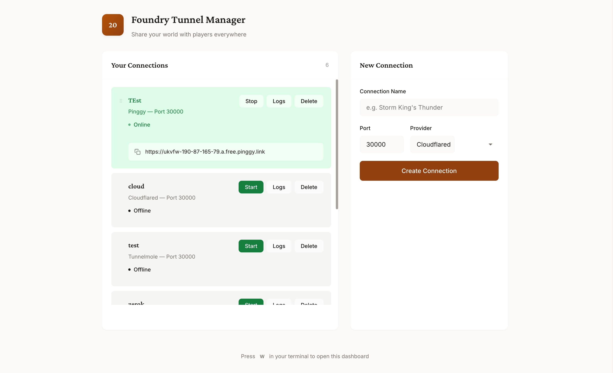

# Foundry Tunnel Manager

Share your Foundry VTT world with players anywhere. No port forwarding needed.



## Features

- **6 tunnel providers**: Cloudflared, Playit.gg, localhost.run, Serveo, Pinggy and Tunnelmole
- **Auto-install**: Downloads and configures providers automatically
- **Web dashboard**: Clean interface to manage connections (press `w` in TUI)
- **Drag & drop**: Reorder connections as you like
- **Real-time updates**: See tunnel status change instantly

## Install

```bash
go install github.com/deadbryam/ftm@latest
```

Or download the binary from [Releases](https://github.com/deadbryam/ftm/releases).

## Usage

```bash
ftm                    # Start TUI
ftm --web              # Web dashboard only
ftm --port 8080        # Custom web port
```

**TUI shortcuts:**
- `↑/↓` - Navigate
- `s` - Start tunnel
- `x` - Stop tunnel
- `l` - View logs
- `c` - Copy URL
- `w` - Open web dashboard
- `a` - Add new tunnel
- `d` - Delete tunnel
- `q` - Quit

## Web Dashboard

Access at `http://localhost:8080` (auto-detected port).

- Click & drag handles (⠿) to reorder
- Click URL to copy
- Edit name/port inline by clicking

## License

MIT
