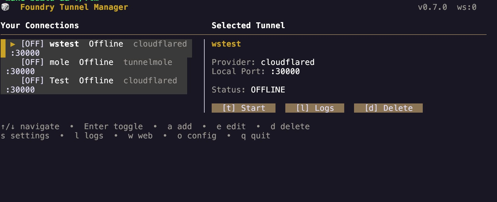
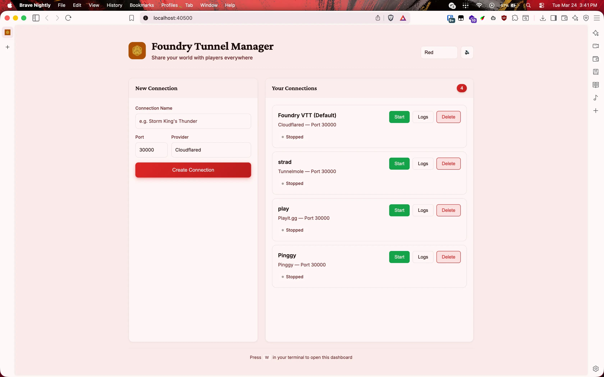
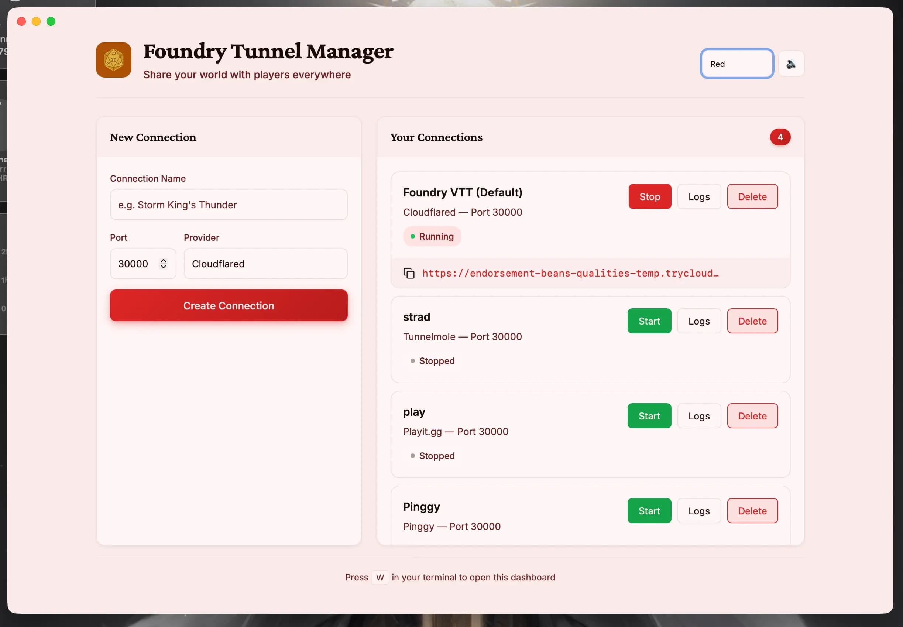

# Foundry Tunnel Manager

Share your Foundry VTT world with players anywhere. No port forwarding needed.

## Features

- **6 tunnel providers**: Cloudflared, Playit.gg, localhost.run, Serveo, Pinggy, Tunnelmole
- **2 interfaces**: TUI, Web dashboard
- **Auto-install**: Downloads providers automatically
- **Drag & drop**: Reorder connections
- **Real-time updates**: Live status changes
- **Theming**: Multiple themes for web dashboard

**TUI shortcuts:** `↑/↓` navigate, `s` start/stop, `l` logs, `c` copy URL, `w` web, `o` open config, `a` add, `d` delete, `q` quit

## Interfaces

### TUI


### Web


Access at `http://localhost:40500` 

### Desktop App


Native desktop application with embedded web server.

## Installation

### Option 1: Install Script (Recommended)

```bash
curl -L https://raw.githubusercontent.com/sthbryan/ftm/main/install.sh | bash
```

This automatically detects your OS and architecture, downloads the correct binary, and installs it to `~/.local/bin`.

### Option 2: Manual Download

Download a prebuilt binary or app from [GitHub Releases](https://github.com/sthbryan/ftm/releases/latest).

#### CLI

| Platform | File |
|----------|------|
| Windows | `ftm-windows-x64.exe` |
| Linux x64 | `ftm-linux-x64` |
| Linux ARM64 | `ftm-linux-arm64` |
| macOS Intel | `ftm-macos-x64` |
| macOS Apple Silicon | `ftm-macos-arm64` |

Then run:

```bash
chmod +x ftm-*
sudo mv ftm-* /usr/local/bin/ftm
```

For macOS Apple Silicon, you may need to remove the quarantine attribute:
```bash
xattr -d com.apple.quarantine /usr/local/bin/ftm
```

#### Desktop App

| Platform | File |
|----------|------|
| Windows | `ftm-desktop-windows.exe` |
| Linux | `ftm-desktop-linux` |
| macOS | `ftm-desktop-macos.app.zip` (extract and run) |

For Linux, make the file executable:
```bash
chmod +x ftm-desktop-linux
```

For macOS, you may need to remove the quarantine attribute before running:
```bash
xattr -d com.apple.quarantine ftm-desktop-macos.app
```

### Option 3: Go

```bash
go install github.com/sthbryan/ftm@latest
```

### Run

```bash
ftm              # TUI
ftm --web        # Web dashboard only
```


## Build from Source

**Requirements:**
- Go 1.21+
- Bun 1.3+ (for building web frontend)
- Wails (for desktop app)

### CLI

```bash
git clone https://github.com/sthbryan/ftm.git
cd ftm

# Build CLI
go build -o ftm ./cmd/ftm
```

### Desktop App

```bash
# Install Wails
go install github.com/wailsapp/wails/v2/cmd/wails@latest

# Build desktop app
cd desktop
wails build -s
```

The built app will be in `desktop/build/bin/`.

## Contributing

1. Fork the repo
2. Create a branch: `git checkout -b feature/amazing`
3. Commit: `git commit -m "Add amazing feature"`
4. Push: `git push origin feature/amazing`
5. Open a Pull Request

## License

MIT License - Copyright (c) 2024 sthbryan

See [LICENSE](LICENSE) for details.
