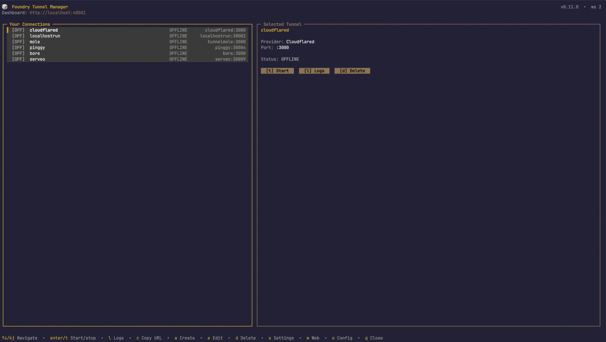
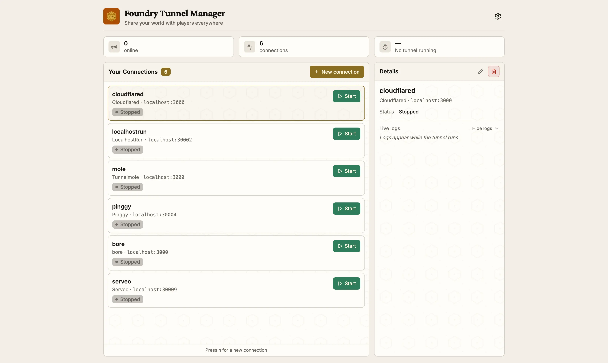
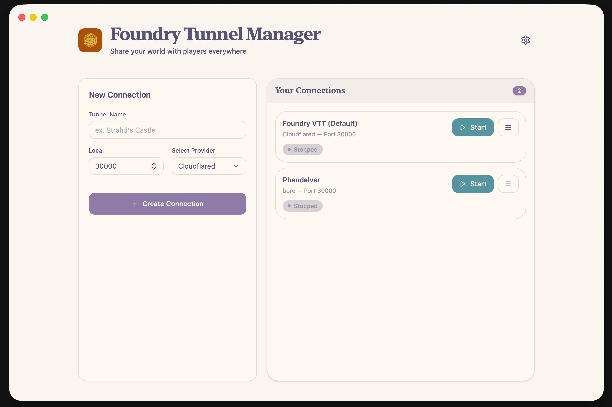

<h1 align="center">ftm</h1>

<p align="center">
  <strong>Foundry Tunnel Manager</strong><br />
  Share your Foundry VTT world without port forwarding.
</p>

<p align="center">
  One binary. Several tunnel providers. Three ways in.<br />
  TUI, web dashboard, or native desktop — same tunnels, same config.
</p>

<p align="center">
  <a href="#install">Install</a>
  •
  <a href="#sixty-seconds">Quick start</a>
  •
  <a href="#interfaces">Interfaces</a>
  •
  <a href="#providers">Providers</a>
  •
  <a href="https://github.com/sthbryan/ftm/releases/latest">Releases</a>
</p>

---

You want players in your Foundry world. Your router, ISP, or CGNAT has other plans. Port forwarding is a pain; random free tunnels mean memorizing flags and babysitting processes.

**ftm starts and stops tunnels for you.** Pick a provider, point it at Foundry’s port, copy the public URL. When a tunnel dies or is about to expire, you get a notification — not a silent failure mid-session.

**It is a single static binary.** Providers are downloaded on demand. Config lives under your user directory. The web UI is embedded, so the same binary drives the TUI, the dashboard, and the desktop shell.

---

## Screenshots

|  |  |  |
| :--: | :--: | :--: |
| **TUI** — start/stop, logs, copy URL | **Web** — dashboard at `:40500` | **Desktop** — same UI in a native window |

---

## Interfaces

**TUI** — `ftm`  
Full-screen terminal UI. Navigate connections, open logs, copy the public URL, jump to the dashboard.

| Key | Action |
|-----|--------|
| `↑` / `↓` | Navigate |
| `enter` / `t` | Start / stop |
| `l` | Logs |
| `c` | Copy URL |
| `w` | Open web dashboard |
| `o` | Open config |
| `a` / `e` / `d` | Add / edit / delete |
| `s` | Settings |
| `?` | Full shortcut list |
| `esc` | Back to the connection list |
| `q` | Back, or quit from the list |

**Web** — always on when ftm runs  
Dashboard at `http://localhost:40500` (port auto-detects if busy). Themes, live status, manage tunnels from the browser.

```bash
ftm --web          # dashboard + open browser
ftm --server       # dashboard only
ftm --port 8080    # force a port
```

**Desktop** — release assets `ftm-desktop-*`  
Wails shell around the same embedded UI. Prefer this if you want a window without keeping a terminal open.

---

## Install

**Homebrew** (macOS and Linux)

```bash
# CLI + embedded web dashboard (TUI + web UI in one binary)
brew install sthbryan/tap/ftm-cli

# Native desktop app — Wails shell around the same UI (macOS only)
brew install --cask sthbryan/tap/ftm
```

The cask runs an ad-hoc codesign and strips quarantine on install, so the first launch works without manual `xattr` cleanup. Formula installs the CLI under the canonical `ftm` name regardless of platform.

```bash
brew update && brew upgrade ftm-cli
brew update && brew upgrade --cask ftm
brew uninstall --cask --zap ftm   # removes config + caches too
```

**macOS / Linux (install script)**

```bash
curl -fsSL https://raw.githubusercontent.com/sthbryan/ftm/main/install.sh | bash
```

Detects OS and arch, installs the CLI to `~/.local/bin` (override with `INSTALL_DIR`), and clears macOS quarantine when needed.

**Linux desktop app (AppImage)**

```bash
chmod +x ftm-desktop-linux-x86_64.AppImage
./ftm-desktop-linux-x86_64.AppImage
```

One file, no install step, icon and menu entry included. Runs on any distro with glibc 2.35 or newer (Ubuntu 22.04+, Debian 12+, Fedora 36+, recent Arch).

It uses the system's WebKitGTK 4.1 rather than bundling it, because WebKitGTK resolves its helper processes from a path fixed at compile time and a bundled copy only works on the distro it was built on. Most desktops already have it; if not:

```bash
sudo apt install libwebkit2gtk-4.1-0   # Debian/Ubuntu
sudo pacman -S webkit2gtk-4.1          # Arch
sudo dnf install webkit2gtk4.1         # Fedora
```

The app checks on startup and prints the right command for your distro if it is missing.

| | |
|---|---|
| **Homebrew** | `brew install sthbryan/tap/ftm-cli` (CLI) or `--cask` for desktop |
| **Install script** | The one-liner above — macOS and Linux |
| **AppImage** | Linux desktop app — one file, no install |
| **Download** | [Releases](https://github.com/sthbryan/ftm/releases/latest) — CLI + desktop apps |
| **From source** | `make install` — needs Go 1.22+ and Bun |

Building from source installs to `$(go env GOPATH)/bin`. Point it somewhere else with `BINDIR`:

```bash
make install BINDIR=/usr/local/bin
```

### CLI assets

| Platform | File |
|----------|------|
| Windows | `ftm-windows-x64.exe` |
| Linux x64 | `ftm-linux-x64` |
| Linux ARM64 | `ftm-linux-arm64` |
| macOS Intel | `ftm-macos-x64` |
| macOS Apple Silicon | `ftm-macos-arm64` |

```bash
chmod +x ftm-*
# e.g. ~/.local/bin or /usr/local/bin
mv ftm-macos-arm64 ~/.local/bin/ftm
```

On macOS, if Gatekeeper blocks the binary:

```bash
xattr -d com.apple.quarantine ~/.local/bin/ftm
```

### Desktop apps

| Platform | File |
|----------|------|
| Windows | `ftm-desktop-windows.exe` |
| Linux | `ftm-desktop-linux` |
| macOS | `ftm-desktop-macos.app.zip` |

```bash
chmod +x ftm-desktop-linux
# macOS: unzip, then if needed:
xattr -d com.apple.quarantine ftm-desktop-macos.app
```

### Flags

| Flag | Effect |
|------|--------|
| *(none)* | TUI + web server |
| `--web` | Web only, open browser |
| `--server` | Web only, no browser |
| `--port N` | Fix the web port |
| `--version` | Print version |
| `--update` | Update to the latest release |
| `--check` | Check for updates only |
| `--uninstall` | Remove the install |

---

## Sixty seconds

```bash
ftm                  # TUI; dashboard at http://localhost:40500
# In the TUI: a → add a tunnel → pick a provider → Foundry port (usually 30000)
# s → start • c → copy public URL • share with players
```

Web-only session:

```bash
ftm --web
```

---

## Providers

| Provider | Notes |
|----------|--------|
| **Cloudflared** | Cloudflare Tunnel — solid default; auto-install |
| **Pinggy** | Quick public URLs |
| **Tunnelmole** | Lightweight; auto-install where available |
| **Bore** | Self-hostable / alternative relay |
| **localhost.run** | SSH-based, no extra binary |
| **Serveo** | SSH-based, no extra binary |

Missing binaries are downloaded when you start a tunnel that needs them. SSH providers only need a working `ssh` client.

---

## Development

Go 1.25+ and Bun. Desktop uses [Wails v3](https://v3.wails.io) (CGO + platform webview; no separate `wails` CLI required for builds).

```bash
make build-full   # web assets + bin/ftm with the UI embedded
make build        # Go only (uses existing embedded static files)
make web          # Svelte build → internal/web/static (+ desktop dist)
make test         # go test ./...
make test-race    # go test -race ./...
make vet          # go vet ./...
make fmt          # gofmt -w, then verify nothing is left unformatted
make install      # web + binary → $BINDIR (default $(go env GOPATH)/bin)
make desktop      # Wails v3 desktop shell → desktop/build/bin/ftm-desktop
make help         # full target list
```

Hot reload against a running ftm web server:

```bash
cd web-svelte && bun run dev
```

**macOS TUI notifications:** install `alerter` (`brew install alerter`) for native alerts. Desktop/GUI paths use the platform APIs.

### Releasing

```bash
make version                  # interactive menu (patch / minor / major / custom)
make version ARGS="patch"     # non-interactive bump
make version ARGS="0.11.0 --dry-run"
```

`make version` (alias: `make release`) updates every place that holds the version string (`internal/version/version.go`, `web-svelte/package.json`, `desktop/wails.json` — both `version` and `productVersion`), commits with `chore(release): vX.Y.Z`, creates an annotated tag, and pushes branch + tag to `origin`. Flags: `--dry-run`, `--no-push`, `--allow-dirty`, `--yes`/`-y`. Run `make version ARGS="--help"` for the full reference.

---

## Design notes

- **One process, three surfaces** — TUI, embedded web, and Wails share the same tunnel manager and config.
- **Providers as plugins** — each tunnel backend implements a small interface; installers download only what you use.
- **Live status** — the dashboard tracks process state over WebSockets so start/stop/errors show up without refresh.
- **Local by default** — the web UI is meant for localhost; treat exposing it beyond your machine as out of scope.

---

<p align="center">
  <sub>MIT License • © 2026 Bryan Villafuerte</sub>
</p>
